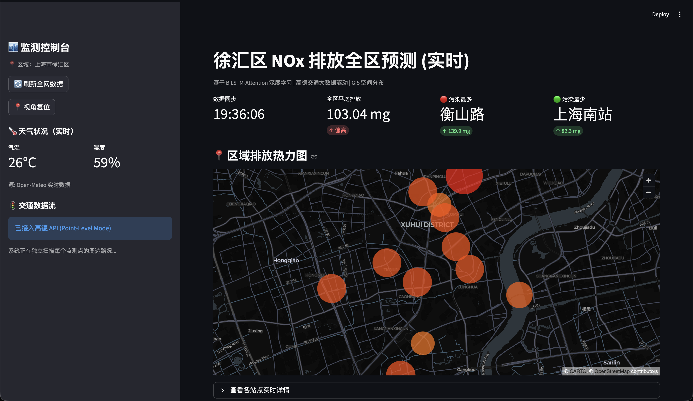
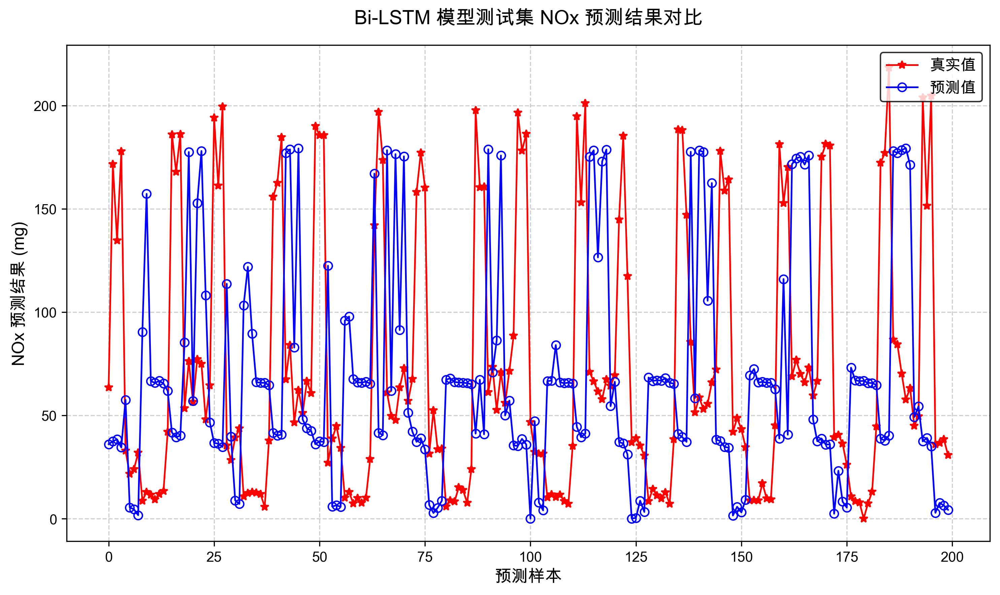
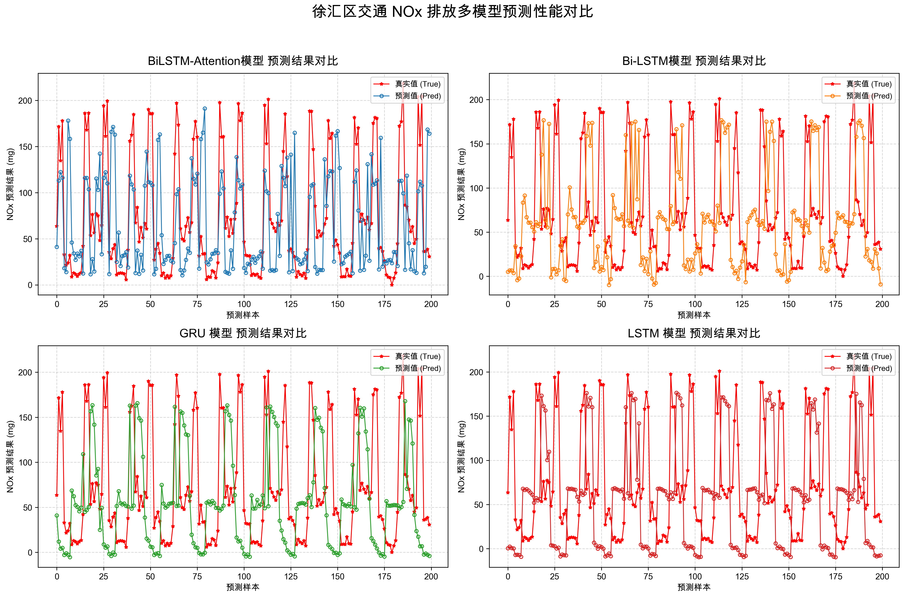

# Urban Traffic NOx Emission Prediction Prototype

A student proof-of-concept project that explores how traffic conditions, weather information, recurrent neural networks, and GIS visualization can be combined in an urban emission prediction workflow.

> **Important scope note:** this repository is a technical prototype, not a real NOx monitoring system. The NOx labels are mainly simulated using vehicle Smog Rating, traffic flow, and congestion factors. During online inference, the 24-hour historical sequence is also partially simulated from the current traffic and weather context. Traffic and weather inputs may come from real-time APIs, but the displayed NOx values are not measurements from environmental monitoring stations. The predictions are for technical demonstration only and must not be used for public health, regulatory, or policy decisions.

## Overview

The project focuses on traffic-related NOx emission patterns in Shanghai's Xuhui District. It includes:

- a bottom-up-inspired vehicle-sampling simulation for creating hourly traffic and emission records;
- a BiLSTM-Attention model that consumes a 24-hour feature window;
- optional real-time traffic data from the AMap Web Service API;
- weather data from Open-Meteo, with wttr.in and local simulation as fallbacks;
- a Streamlit dashboard with PyDeck-based GIS visualization;
- an offline mode for demonstrations without API credentials or network access.

The main value of the project is the integration of data simulation, sequence modeling, external APIs, inference, and interactive visualization in one runnable, documented prototype.

## Project Background

Traffic emissions vary with traffic volume, vehicle speed, fleet composition, congestion, weather, and time of day. Access to complete, point-level NOx monitoring data is limited, especially for a student project. I therefore used a simulation-based approach to study the engineering workflow before attempting a future real-data implementation.

The project originated from a university innovation and entrepreneurship training project. Its engineering objective was to explore whether a practical prototype could connect traffic context, temporal modeling, and spatial presentation without claiming operational environmental forecasting capability.

## My Role and Contributions

As part of the student project, I was mainly responsible for the following technical work:

- designed the traffic and emission simulation logic;
- prepared vehicle emission attributes used by the simulator;
- constructed 24-hour sequences for time-series learning;
- implemented and trained the three-layer BiLSTM-Attention model in PyTorch;
- implemented baseline comparisons with LSTM, GRU, and BiLSTM models;
- integrated AMap traffic data and public weather services;
- added API failure handling and offline fallback data;
- developed the Streamlit interface and PyDeck map visualization;
- reorganized the project into a runnable, documented repository for public presentation.

## Key Features

- **24-hour temporal input:** each model input contains 24 time steps.
- **BiLSTM-Attention model:** bidirectional recurrent layers are followed by temporal attention and fully connected output layers.
- **Traffic API integration:** traffic conditions can be requested around 12 landmarks in Xuhui District.
- **Weather integration:** temperature and humidity are requested from public weather services when available.
- **Graceful offline mode:** simulated traffic and weather values allow the interface to run without an API key or network access.
- **GIS presentation:** predicted point values are displayed using PyDeck scatterplot layers.
- **Baseline experiments:** earlier LSTM, GRU, and BiLSTM models are retained for comparison and project history.

## System Architecture

```text
Offline training pipeline
-------------------------
Vehicle attribute sample
        |
        v
Simplified traffic-emission simulation
        |
        v
Simulated hourly dataset
        |
        v
Standardization + 24-hour training windows
        |
        v
BiLSTM-Attention training
        |
        v
Saved model weights

Dashboard inference pipeline
----------------------------
AMap traffic API or traffic fallback ----+
Weather APIs or weather fallback --------+--> current feature construction
                                                   |
                                                   v
                                      partially simulated 24-hour sequence
                                                   |
                                                   v
                                      saved-model inference
                                                   |
                                                   v
                                      Streamlit + PyDeck visualization
```

The two pipelines are separate. The existing model is trained only on the stored simulated hourly dataset; current AMap and weather API responses are not used to train it. During dashboard inference, current contextual data are combined with heuristic assumptions to reconstruct a partially simulated 24-hour sequence.

## Data Sources and Simulation

### Vehicle sample

[`data/sample/vehicle_emissions_2026.csv`](data/sample/vehicle_emissions_2026.csv) contains 483 vehicle records with fuel-consumption, CO2, CO2 rating, and Smog Rating fields. Smog Rating is used in the active NOx proxy calculation. CO2 may be calculated or retained as source metadata, but it is not used by the active NOx proxy label, the current training dataset, or the model input.

### Simulated traffic and NOx data

[`data/processed/shanghai_traffic_simulation.csv`](data/processed/shanghai_traffic_simulation.csv) contains 2,160 hourly rows generated for the prototype. Its fields are:

- `Hour`
- `Traffic_Volume`
- `Average_Speed`
- `Temperature`
- `Humidity`
- `NOx_Emission`

The NOx target is not a monitoring-station measurement. It is mainly calculated from sampled vehicle Smog Ratings, estimated fuel-vehicle counts, and a congestion multiplier. Traffic volume, speed, temperature, and humidity also include simulated distributions and random variation.

> **Output-unit note:** the displayed NOx values are model-output units from a simulated proxy task. They should not be interpreted as calibrated milligrams, concentration measurements, or regulatory emission estimates.

### Online inputs

When configured, AMap supplies current traffic descriptions and road speeds. Open-Meteo or wttr.in may supply current temperature and humidity. The application then constructs a 24-hour sequence using time-of-day factors and random perturbations. Consequently, even when APIs are available, the historical sequence and NOx output remain partly simulation-based.

See [data/README.md](data/README.md) and [docs/methodology.md](docs/methodology.md) for details.

## Model Architecture

The main model uses five features per time step:

```text
[Traffic_Volume, Average_Speed, Temperature, Humidity, Hour]
```

Its current architecture is:

- sequence length: 24;
- three-layer bidirectional LSTM;
- hidden size: 128 in each direction;
- dropout: 0.3 between recurrent layers;
- temporal attention over all 24 LSTM outputs;
- fully connected layer from 256 to 64 dimensions;
- ReLU activation;
- one linear output for simulated NOx emission.

Features are standardized with `StandardScaler`, while the target is transformed with `MinMaxScaler`.

## Technology Stack

- Python
- PyTorch
- pandas and NumPy
- scikit-learn
- Streamlit
- PyDeck
- Requests
- Matplotlib
- AMap Web Service API
- Open-Meteo and wttr.in

## Repository Structure

```text
.
├── app/
│   └── streamlit_app.py          # Dashboard and online inference
├── src/
│   ├── traffic_service.py        # AMap integration and traffic fallback
│   └── weather_service.py        # Weather APIs and weather fallback
├── scripts/
│   ├── generate_simulation_data.py
│   ├── train_model.py
│   └── evaluate_models.py
├── data/
│   ├── README.md
│   ├── sample/                    # Vehicle attributes used by simulation
│   └── processed/                 # Generated hourly training data
├── models/
│   └── bilstm_attention.pth
├── assets/                        # Development-stage result figures
├── docs/
│   ├── methodology.md
│   └── limitations.md
└── legacy/                        # Historical code, models, and experiments
```

## Installation

Python 3.11 is recommended because it matches the environment used during the latest project cleanup.

```bash
git clone <repository-url>
cd <repository-directory>
python3 -m venv .venv
source .venv/bin/activate
pip install -r requirements.txt
```

On Windows, activate the environment with:

```powershell
.venv\Scripts\activate
```

## Configuration

AMap access is optional. Without a key, the application automatically uses simulated traffic values.

Set the key as an environment variable:

```bash
export AMAP_API_KEY="your_amap_api_key"
```

Alternatively, create a local `.streamlit/secrets.toml` file:

```toml
AMAP_API_KEY = "your_amap_api_key"
```

The local secrets file is excluded by `.gitignore`. Do not commit API credentials. The application also accepts the older variable name `AMAP_KEY` for compatibility.

## Running the Streamlit App

From the repository root:

```bash
streamlit run app/streamlit_app.py
```

The application loads the processed simulation dataset and the included model weights. If traffic or weather services are unavailable, it continues in offline demonstration mode.

## Training and Evaluation

Regenerate the simulation dataset:

```bash
python scripts/generate_simulation_data.py
```

This overwrites `data/processed/shanghai_traffic_simulation.csv` with a newly randomized simulation.

Train the main model:

```bash
python scripts/train_model.py
```

The resulting weights are saved to `models/bilstm_attention.pth`.

Run the development-stage model comparison:

```bash
python scripts/evaluate_models.py
```

This loads the main model and three historical baselines and writes a new evaluation output to `assets/model_comparison.png`. This generated file is separate from the retained historical figure `assets/model_comparison_legacy.png`.

## Demo and Screenshots

The Streamlit dashboard presents the 12 Xuhui landmarks, contextual traffic and weather information, model-output summaries, and a PyDeck map. Depending on API availability and configuration, the screenshot may show real-time contextual inputs or fallback data; the displayed NOx values remain outputs of the simulated proxy task.



## Results and Development Figures

The current figures record early model iteration and a legacy comparison among several recurrent architectures. Because the evaluation procedure is not a controlled held-out benchmark, the figures cannot support a strict or reliable model ranking.





`assets/model_comparison_legacy.png` is the historical model comparison retained from an earlier experiment. Running `python scripts/evaluate_models.py` performs the current comparison procedure and generates a separate re-evaluation output at `assets/model_comparison.png`; it does not replace or describe the provenance of the legacy figure.

The current evaluation has important weaknesses:

- the labels are simulated;
- the training script uses the complete generated sequence rather than a strict train/validation/test split;
- the comparison script evaluates the last 200 rows from the same generated dataset;
- the comparison script repeats each single row across 24 time steps instead of using true held-out historical windows;
- randomness is not fully controlled with fixed seeds.

The displayed values are model-output units from a simulated proxy task, not calibrated milligrams or concentration measurements. See [docs/limitations.md](docs/limitations.md) for the full evaluation and interpretation constraints.

## Limitations

- Labels and online historical inputs are substantially simulation-based.
- Current evaluation does not provide a rigorous estimate of performance on unseen time periods or real sensor data.
- Output units and map symbols are not calibrated environmental measurements.
- The model omits important atmospheric, spatial, road, and fleet variables.

The complete limitation statement is available in [docs/limitations.md](docs/limitations.md).

## Future Work

- replace simulated labels with timestamped measurements from official air-quality stations or calibrated roadside sensors;
- align traffic, weather, and NOx observations by time and location;
- use chronological train, validation, and test splits;
- save preprocessing scalers with the model to avoid refitting during deployment;
- compare against statistical and machine-learning baselines using reproducible metrics;
- add fixed random seeds, configuration files, tests, and experiment tracking;
- use measured historical sequences for online inference;
- incorporate wind, precipitation, road type, fleet composition, and nearby-station context;
- evaluate uncertainty and calibration rather than displaying only point estimates.

## Data and API Attribution

- **AMap Web Service API:** optional traffic-status source. Use is subject to AMap's terms, account permissions, and request limits.
- **Open-Meteo:** primary public weather source used for current temperature and relative humidity.
- **wttr.in:** secondary weather fallback.
- **Vehicle emission attributes:** the included sample contains fuel-consumption, CO2, and Smog Rating fields. Smog Rating is used by the active NOx proxy; CO2 is not an active training feature or NOx-label input. Before redistributing or extending the dataset, users should verify the original source terms and add the appropriate citation or license information.
- **NOx data:** no official monitoring-station NOx dataset is used by the main pipeline. The target values in this repository are simulation outputs.

Historical experiments and unused datasets are separated under `legacy/`; see [legacy/README.md](legacy/README.md).
